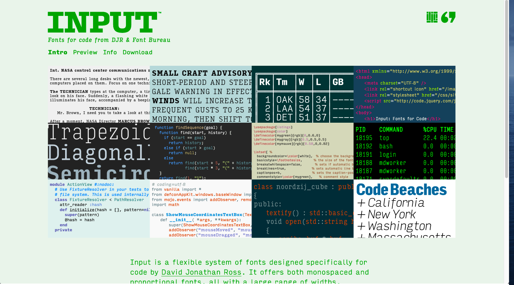
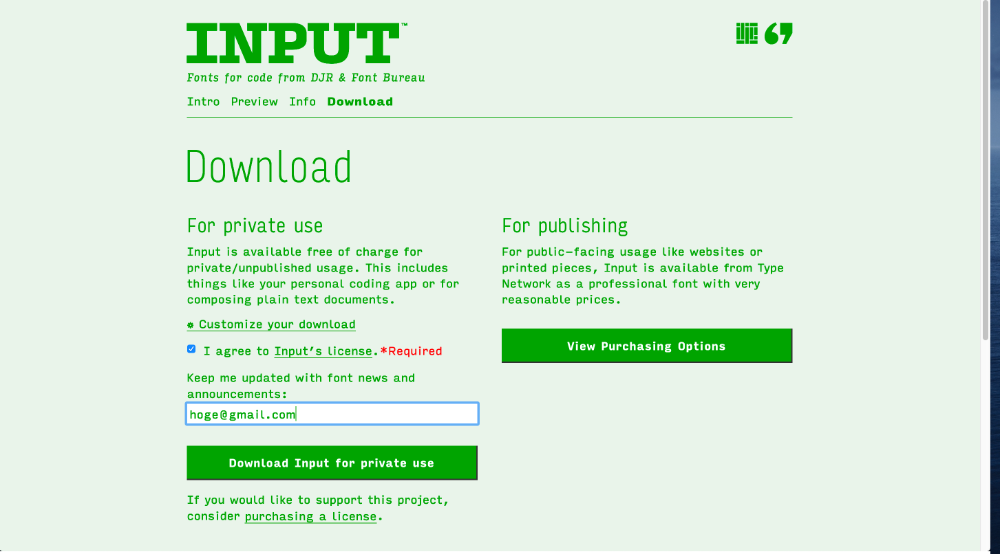
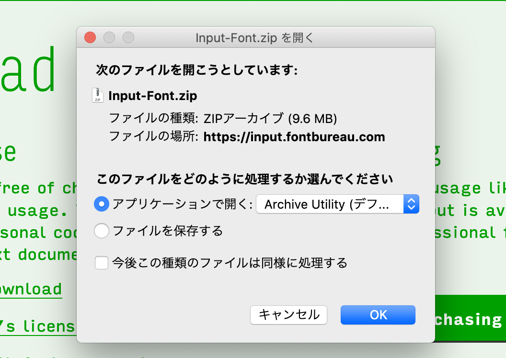
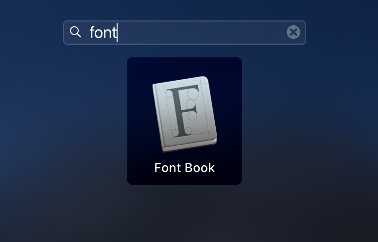
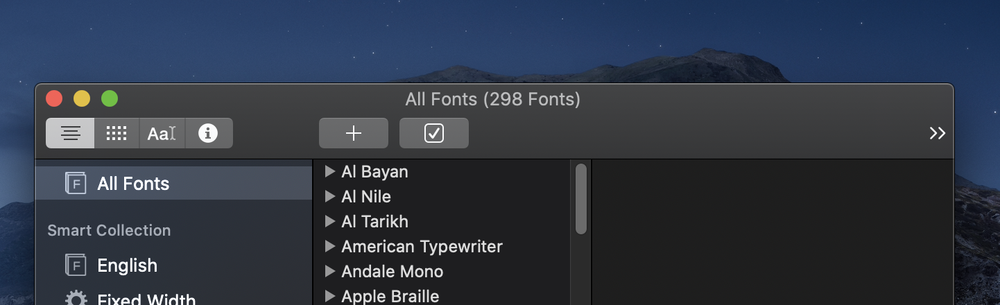
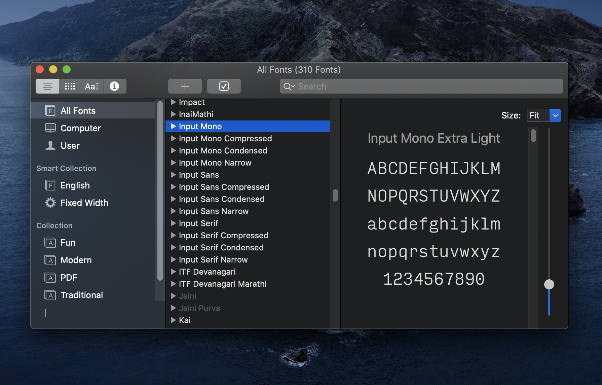
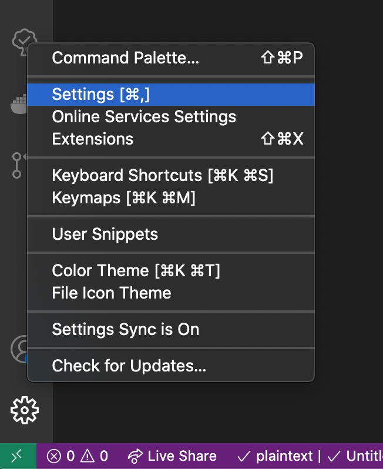
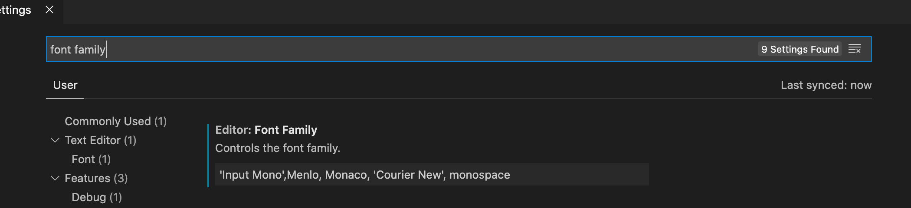

皆さんはフォントに拘りとかありますか？私はこの Input というフォントが結構好きです。  

開発者向けのフォントで、形が似ていいて紛らわしい文字でもこのフォントだと容易に識別できるのでおすすめです。シルエットも普通に可愛いですしね。

[このあたり](https://input.fontbureau.com/info/)にフォント設計のストーリーが掲載されています。自分も全部は読めていないので時間を見つけて読みたいと思っていますが、かなり試行錯誤して設計された様子が十分に伝わってきますね。  
個人的にはこういうのを見ると自分も頑張ろうと、モチベーションが高まります。  
今回は Input を Mac + Visual Studio Code 環境で使用できるようにする方法のご紹介です。

# Input のインストール

まずは INPUT のインストールからです。公式サイトのダウンロードページへ行きます。  
[ダウンロードページ](https://input.fontbureau.com/download/)  
規約同意のチェックボックスにチェックを入れ、メールアドレスを入力後メールアドレスを入力後「Download Input for private use」をクリックします。  
 
ダイアログが表示されますので「OK」をクリックします。  


# Mac へ Input をインストールする

次は Mac へ先ほどダウンロードしてきた Input をインストールしていきます。まずは Font Book を起動してください。

ウィンドウ上部メニューにある「＋」ボタンをクリックします。

ダウンロードしてきた「Input-Font」内の「Input_Fonts」を選択し、「Open」をクリックします。

これで Mac へ Input をインストールすることが出来ました。


# Visual Studio Code のフォントを設定する

最後です。まずは Visual Studio Code を開きます。  
左下の歯車アイコンから「Settings」をクリックします。

検索窓で「font family」と検索し、Font Family を以下のように設定します。このあたりはお好みで色々試されてみてください。

```
'Input Mono',Menlo, Monaco, 'Courier New', monospace
```


以上で完了です。反映されない場合は再起動を試して見てください。
