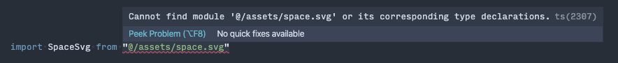

# 手順

1. [`gatsby-plugin-react-svg`](https://www.gatsbyjs.com/plugins/gatsby-plugin-react-svg/) をインストールする
2. `gatsby-config.js`の plugins に`gatsby-plugin-react-svg`を追記する
3. svg の型定義ファイルを作成する
4. `tsconfig.json`で型定義ファイルを認識させる

# 手順詳細

```
$ yarn add gatsby-plugin-react-svg
```

```javascript
// gatsby-config.js

plugins: [
  {
    resolve: "gatsby-plugin-react-svg",
    options: {
      rule: {
        include: /assets/, // 読み込みたいSVGファイルが置いてあるフォルダを指定する
      },
    },
  },
]
```

普通の JavaScript であれば、ここまでの設定で以下のように SVG ファイルをコンポーネントとして import 出来るようになります。

```js
import Icon from "./path/assets/icon.svg"

// ...
;<Icon />
```

しかし TypeScript で開発している場合は、以下の様に型定義ファイルがないことでエラーが発生します。

なので型定義ファイルを追加します。

```js{3-8}
// src/index.d.ts

declare module "*.svg" {
  import React = require("react")
  export const ReactComponent: React.SFC<React.SVGProps<SVGSVGElement>>
  const src: string
  export default src
}
```

tsconfig.json に、下記を追記しこの型定義ファイルを読み込めば完了です。

```json{5-8}
// tsconfig.json

"compilerOptions": {
    //...
    "baseUrl": ".",
    "paths": {
      "*": ["src/*"]
    }
  }

```
